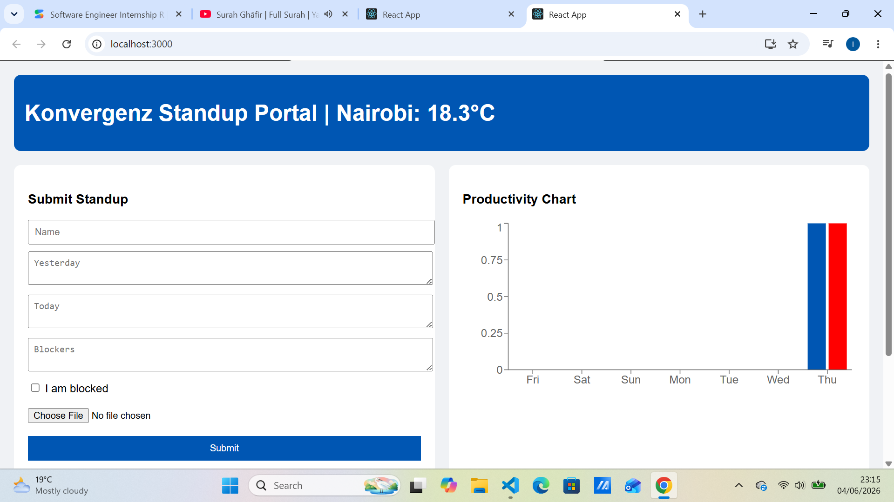
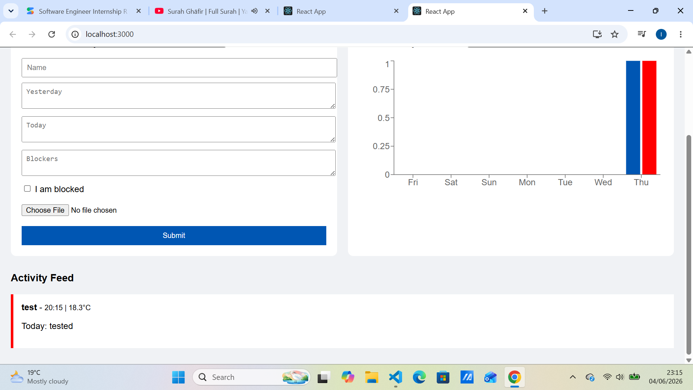

# Team Standup Logger

## How to Run locally:
1. **Backend:** `cd backend`, run `pip install -r requirements.txt`, then `python app.py`.
2. **Frontend:** `cd frontend-app`, run `npm install`, then `npm start`.

## Features:
- Real-time weather API integration.
- Automated activity feed polling (10s).
- Blocker tracking and productivity charts.
- File upload support.
- ## Dashboard Screenshots
### Project Overview

### Live Activity Feed

